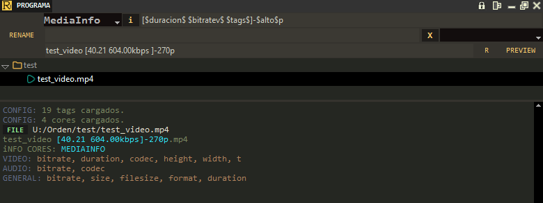
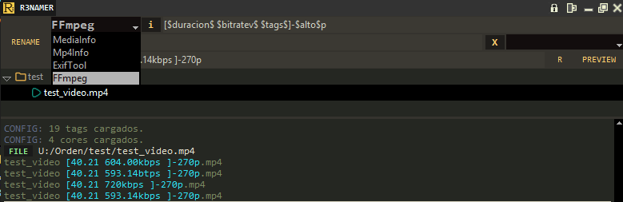

# R3nom

utilidad para renombrar archivos de video (agregando info del video), version en tkinter



usando cores (obtener info de distintas formas `4 disponibles`)


## Librerias necesarias

```py```
pillow==11.1.0
pyinstaller==6.11.1
tkinterdnd2-universal==1.7.3
toml==0.10.2
pystray==0.19.5
```
